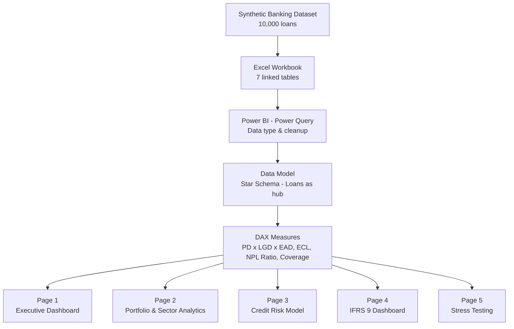
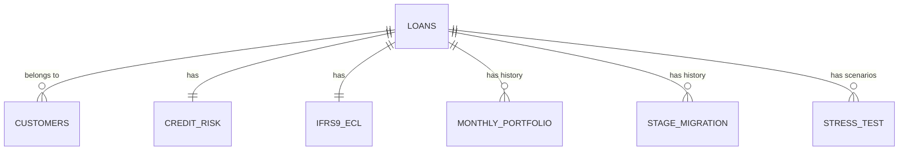

# Credit Risk Portfolio & IFRS 9 Analytics Dashboard


An end-to-end **Credit Risk Analytics dashboard** built in Power BI, covering portfolio monitoring, PD/LGD/EAD credit risk modeling, IFRS 9 ECL staging, stage migration analysis, and stress testing — the kind of reporting used by banks and NBFCs for portfolio risk management and regulatory disclosure.

---

## 📌 Project Overview

This project simulates a bank's credit risk portfolio (10,000 loan accounts) and builds a 5-page interactive dashboard covering the complete risk analytics cycle: **data → risk calculations → visualization → management insight**.

| Page | Focus |
|---|---|
| 01 – Executive Dashboard | Portfolio KPIs, NPL trend, sector composition, top obligors |
| 02 – Portfolio & Sector Analytics | Sector/region/product exposure, concentration, risk grade mix |
| 03 – Credit Risk Model | PD, LGD, EAD, Expected Loss (PD × LGD × EAD) |
| 04 – IFRS 9 Dashboard | Stage 1/2/3 classification, ECL by stage, Stage Migration Matrix |
| 05 – Stress Testing | Base / Moderate / Severe scenario impact on ECL, PD, LGD |

---

## 🏗️ Architecture



### Data Model (Star Schema)



`Loans` sits at the center of the model; all risk, IFRS 9, and stress-testing tables relate back to it through `Loan_ID`, keeping filter context consistent across every page.

---

## 📊 Key Metrics & DAX

Core measures built for this dashboard:

```dax
Total Exposure = SUM(Loans[Outstanding_Balance_PKR])

NPL Ratio = DIVIDE([NPL Amount], [Total Exposure], 0)

Total Expected Loss = SUM(Credit_Risk[Expected_Loss_PKR])
-- Underlying logic: Expected Loss = PD x LGD x EAD

Coverage Ratio = DIVIDE([Total ECL], [NPL Amount], 0)

Stage 3 Exposure = 
CALCULATE([Total EAD], IFRS9_ECL[IFRS9_Stage] = 3)

ECL Impact = [Stressed ECL] - [Total ECL]
```

Full measure list is documented inside the `.pbix` file's Measures table.

---

## 🖼️ Sample Output

**Executive Dashboard** — Total Exposure, NPL Ratio, ECL, Coverage Ratio, sector composition, and NPL trend at a glance.

**IFRS 9 Dashboard** — Stage 1/2/3 exposure and ECL breakdown, with a Stage Migration Matrix showing loan movement between stages (deterioration vs. cure rates).

**Stress Testing** — Base / Moderate / Severe scenario comparison showing ECL impact under stressed PD and LGD assumptions.

*(See `/screenshots` folder for full-resolution page captures.)*

| Metric | Value |
|---|---|
| Total Exposure | PKR 853bn |
| NPL Ratio | 10.27% |
| Total ECL | PKR 23bn |
| Coverage Ratio | 26.57% |
| Total Obligors | 10,000 |
| Average PD | 6.34% |

---

## ⚙️ Tech Stack

- **Power BI Desktop** — data modeling, DAX, visualization
- **Power Query** — data cleanup and type transformation
- **DAX** — CALCULATE, DIVIDE, star-schema filter propagation
- **Excel** — synthetic dataset generation (10,000 loans, 7 linked tables, ~100K+ total records across history/migration/stress tables)

---

## 🧩 Technical Challenges & Solutions

| Challenge | Root Cause | Solution |
|---|---|---|
| Filters not propagating from Customers to Loans | Relationship cardinality was reversed (Customers set as "many" side) | Corrected cardinality to One-to-Many (Customers = 1, Loans = many) |
| Ambiguous filter paths across risk tables | Credit_Risk was incorrectly used as the model hub, with other tables relating to it instead of Loans | Rebuilt relationships so all tables (Credit_Risk, IFRS9_ECL, Monthly_Portfolio, Stage_Migration, Stress_Test) relate directly to Loans (star schema) |
| Date axis showing raw serial numbers (e.g. 45900) instead of dates | Date columns imported as Whole Number instead of Date | Changed column data type to Date in Power Query/Model view for all reporting date fields |
| Stage-based measures returning errors | DAX filters compared a numeric column (`IFRS9_Stage` = 1/2/3) against text (`"Stage 1"`) | Verified underlying data type in Data view and rewrote CALCULATE conditions to match numeric values |
| Cross-highlighting made KPIs appear filtered/incorrect | Clicking a chart element cross-highlighted the whole page, mimicking a broken measure | Cleared selection via blank canvas click; distinguished real filter bugs from normal cross-highlighting behavior |
| Stressed metrics showing inflated (3x) totals | No scenario filter applied, so Base/Moderate/Severe rows were being summed together | Added a Scenario slicer so stressed measures reflect a single selected scenario |

---

## 📁 Repository Structure

```
├── Credit_Risk_Portfolio_IFRS9_Dashboard.pbix
├── Credit_Risk_Portfolio_Analytics_Dataset.xlsx
├── screenshots/
│   ├── 01_executive_dashboard.png
│   ├── 02_portfolio_sector_analytics.png
│   ├── 03_credit_risk_model.png
│   ├── 04_ifrs9_dashboard.png
│   └── 05_stress_testing.png
└── README.md
```

---

## 🚀 About This Project

Built as part of a hands-on portfolio demonstrating practical credit risk analytics skills: SQL-style data modeling, DAX-driven risk calculations, IFRS 9 compliance reporting, and stress-testing scenario analysis — end to end in Power BI.

**Connect with me** — open to Credit Risk Analytics, Power BI Development, and Finance Automation roles.

📇 **Contact**

[](https://linkedin.com/in/syed-ali-raza1990)
[](mailto:Alisherazi51215@Yahoo.Com)
[](https://wa.me/923135006069)

---

*Note: All data in this project is synthetically generated for portfolio demonstration purposes and does not represent any real institution's data.*
